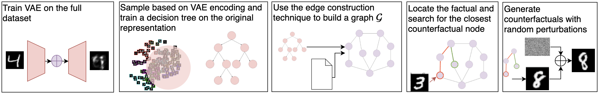
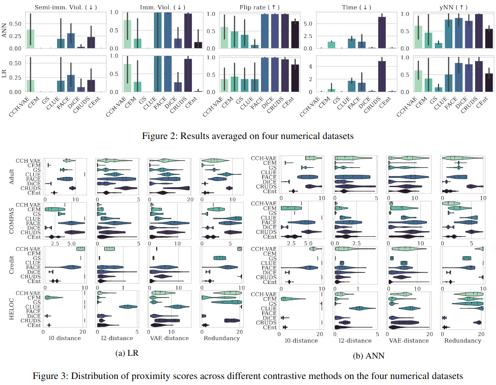
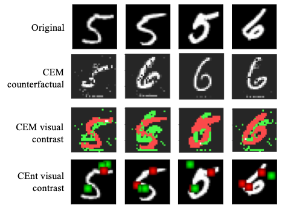
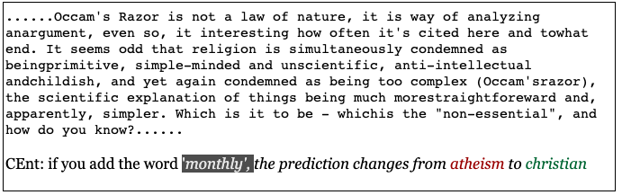

<div align="center">

# CEnt: An Entropy-based Model-agnostic Explainability Framework to Contrast Classifiers’ Decisions

Official Implementation of our CEnt [paper](https://arxiv.org/abs/2301.07941).

</div>

<p align="center">
  
</p>

## Abstract

>  Introducing CEnt - a powerful and innovative entropy-based method for interpreting machine learning models and understanding the decision-making process behind them. CEnt provides actionable alternatives for individuals facing an unfavorable outcome by generating feasible feature tweaks that can alter the model's decision. Our approach takes into account immutability and semi-immutability constraints, employs local sampling on manifold-like distances computed by VAEs, and generates counterfactuals that achieve better proximity rates without compromising latency, feasibility, and attainability. It is a powerful tool for understanding and improving decision-making systems, can even be used to detect vulnerabilities in textual classifiers and shows high potential for image classifiers.

>based on [CARLA Framework](https://github.com/carla-recourse/CARLA)

## Installation

Getting the Source Code

```shell
git clone git@github.com:mohamadmansourX/CEnt.git
cd CEnt/
```

Install the dependencies:

```
bash install.sh
```

Or, if you prefer to using conda:

```shell
conda env create -f environment.yml
```

## Quick Start

Prepare the resource method and black box models for tabular data:

```python
from cent.method import CEnt
from cent.data_specific import DataModels

# Select from ['adult','compas', 'give_me_some_credit', 'heloc']
data_name = 'adult'

# Prepare the black box models and data_splits
OUT_DIR_DATA = 'outputs/tmp/'
if not os.path.exists(OUT_DIR_DATA):
    os.makedirs(OUT_DIR_DATA)
data_models = DataModels(data_name = data_name,
                             out_dir = OUT_DIR_DATA)


# data_models now contains parmeters for the data (data_models.trainData) and the models (data_models.models_zoo)
# Let's get the tensorflow ann model
mlmodel = data_models.models_zoo['ann']['tensorflow']

# Set the hyperparameters for our CEnt method
hpr = {"data_name":"adult",
        "myvae_params": {
            'input_dim': len(mlmodel.feature_input_order),
        },
        "tree_params": {
            "min_entries_per_label": 500,
            "max_search" : 50,
            "grid_search": {"cv": 1,"splitter": ["best"],"criterion": ["gini"],"max_depth": [3,4,5,6,7],
                            "min_samples_split": [1.0,2,3],"min_samples_leaf": [1,2,3],
                            "max_features": ['sqrt',1.0, 'log2',0.8],
                            }
        }
    }

# Initialize the CEnt method
cent_method =  CEnt(ddata_models.trainData, mlmodel, hpr, data_catalog= data_models.new_catalog_n)
```

Start a counterfactual search:

```python
# Get a radnom factual
factual = {'age': 0.164, 'fnlwgt': 0.077, 
            'education-num': 0.533, 'capital-gain': 0.0,
            'capital-loss': 0.0, 'hours-per-week': 0.347,
            'income': 0, 'marital-status_Non-Married': 1.0,
            'native-country_US': 1.0, 'occupation_Other': 1.0,
            'race_White': 1.0, 'relationship_Non-Husband': 1.0,
            'sex_Male': 0.0, 'workclass_Private': 1.0}

# Get its counterfactual (~0.02 seconds)
ff = pd.DataFrame(ff, index=[0])
contrast = cent_method.get_counterfactuals(ff)
contrast
```

Output:
```
age	fnlwgt	education-num	capital-gain	capital-loss	...	occupation_Other	relationship_Non-Husband	race_White	sex_Male	native-country_US
0	0.164384	0.076916	0.764858	0.071366	0.0	...	1.0	1.0	1.0	0.0	1.0
1 rows × 13 columns
```


For more explanation for the results:

```python
cent_method.explain_in_text(fact)
```

Output:

```
To flip the binary class from 0 to 1, we moved our factual to a point satisfying the following conditions:
	education-num need to be > than 0.7666666805744171
	marital-status_Non-Married need to be flipped to False
	capital-gain need to be > than 0.0748707503080368
```

## Experiments Results

### Tabular Data

CEnt improvement in proximity, latency, and attainability with no constraint violation compared to previous methods


#### Tabular Benchmarks against SOTAs Counterfactual Methods
<p align="center">
  
</p>

### Images Data

CEnt also was also able to achieve great and very potential results in the image applications as seen in the case of mnits.

CEnt was able to better understand the image and trace the pixels to flip the class instead of going to a whole new drawing as in CEM.

<p align="center">
  
</p>

### Text Data

CEnt was also tested on text data and was able to flip the predictions.  CEnt can then serve as a debugging tool that highlights vulnerabilities in the context of adversarial attacks.

<p align="center">
  
</p>

## Running the Benchmarks


```shell
python becnhmark_experiment.py
```

For each dataset the following will be created:

```shell
$tree outputs/

outputs/
└── adult
    ├── bench_csvs
    │   ├── cent_tensorflow_ann_bench.csv
    │   ├── cent_tensorflow_ann_counterfactuals.csv
    │   ├── cent_tensorflow_ann_DTScores.csv
    │   ├── cent_tensorflow_ann_factuals.csv
    │   ├── dice_tensorflow_ann_bench.csv
    │   ├── dice_tensorflow_ann_counterfactuals.csv
    │   ├── dice_tensorflow_ann_factuals.csv
    │   ├── growing_spheres_tensorflow_linear_bench.csv
    │   ├── growing_spheres_tensorflow_linear_counterfactuals.csv
    │   └── growing_spheres_tensorflow_linear_factuals.csv
    │   └──   .
    │   └──   .
    │   └──   .
    ├── benchmark_results.csv
    ├── checks.csv
    ├── loss_plot.png
    ├── loss_plot_steps.png
    ├── models_logs.txt
    └── model_zoo_metrics.csv
└── compas
  .
  .
  .

```

- `model_zoo_metrics.csv`: contains the metrics of the black-box models used in the experiments (common between resource for each dataset).
- `models_logs.txt`: contains the logs of the black-box models used trainings.
- `benchmark_results.csv`: contains the dataframe of the results of the experiments per dataset using the 9 implemented metrics.
- `checks.csv`: contains info of what resource failed or ran successfully.
- `loss_plot.png`: plot of the loss of vae benchmark per step.
- `loss_plot_steps.png`: plot of the loss per epoch
- `bench_csvs`: contains the csv files results per recourse per model type e.g. for dataset `adult`, resource `cent`, model type `ann` there will be {factuals: `cent_tensorflow_ann_bench.csv`}, {counterfactuals: `cent_tensorflow_ann_counterfactuals.csv`}, and {benchmarks: `cent_tensorflow_ann_bench.csv`} csv files.

# Bugs or questions

If you have any questions related to the paper or the theoretical background, please contact the authors via email: Julia El Zini (jwe04@mail.aub.edu) or Mohamad Mansour (mgm35@mail.aub.edu)

If you have any questions related to the code, please open an issue on the github repository.

# Citation

Please cite our paper if you use this code in your own work:

```
misc{https://doi.org/10.48550/arxiv.2301.07941,
  author = {Zini, Julia El and Mansour, Mohammad and Awad, Mariette},
  title = {CEnt: An Entropy-based Model-agnostic Explainability Framework to Contrast Classifiers' Decisions},
  publisher = {arXiv},
  year = {2023},
  doi = {10.48550/ARXIV.2301.07941},
  url = {https://arxiv.org/abs/2301.07941},
  copyright = {Creative Commons Attribution Non Commercial Share Alike 4.0 International}
}
```
